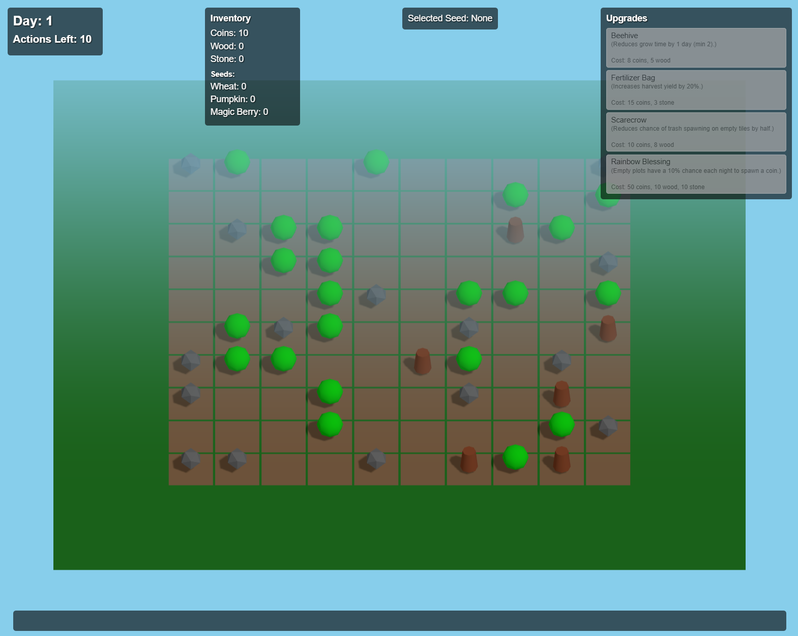

# Vibe Farmer

## TL;DR

Vibe Coded Farming Game, using Google's Gemini 2.5 Pro Experimental:

### Gameplay

* Collect seeds from weed; stone and wood
* Plant the seeds and watch them grow
* Harvest for coin
* Buy upgrades

### Screenshot

### Just Play It!

Clone this project, run with `npx serve` (with Node.js installed) in the project root.

## Creation Process

_System Prompt_

You are a three.js coder that writes code that follows Clean Code principles, e.g. like summarized in https://gist.github.com/wojteklu/73c6914cc446146b8b533c0988cf8d29

_User Prompt_

In pure three.js, create a 2.5d farming simulator game.
On a 10x10 cell grid, that starts with random thrash - weed, wood, stone, empty.
Clicking weed return a random seed, wood and stone collect one unit of wood and stone respectively, clicking empty takes a seed if you have any, and makes the tile a farm plot.
A day cycle allows 10 such actions.
Overnight, empty cells are converted with 25% chance to a new trash item. Farm plots grow one step in seed dependent 3-7 day cycle.
Fully grown plots can be harvested for fruit that yields the grow time in coins.
Upgrades can be bought for coin+resource combinations, e.g. beehive = 5 wood + 8 coins -> farm cycle decreases 1 day (with a minimum of 2 days).
Add fun new seeds, rules, upgrades.

## Zero-Shot Settings

Temperature has been reduced to 0.2.

AI Studio Chat Link, if functional:

https://aistudio.google.com/prompts/1HnGmFCfX5beNoYrkFb_fKMFRzMTA1dTC

## Zero-Shot Results

Token count: 16261

### Thoughts

See [ZERO_SHOT.thoughts.md](ZERO_SHOT.thoughts.md)

### Results

Contains a transcript with all files to be created, and how to run.

See [ZERO_SHOT.response.md](ZERO_SHOT.response.md)

### Running the Game

In the root of the project (with Node.js installed):

`npx serve`

And follow the provided link.

Start clicking weeds, stone, and wood, and start farming!
